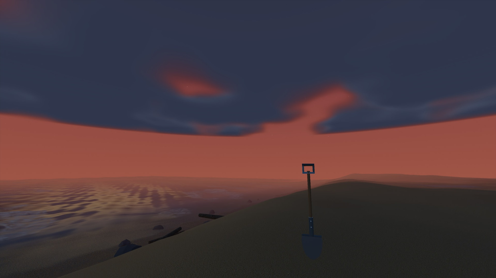

# Deserted Island

<p align="center">
  
</p>

A walkable first-person tropical island for **ThreeBrowser Runtime** and
**desktop browsers with WebGPU**. The same source paints one canvas: dunes,
tiled sand and greywacke rocks, coconut palms, Gerstner water, a day/night
cycle, and optional native RTX lighting when `navigator.gpu.threeBrowserRTX`
is present.

There is no WebGL fallback.

## Play in a browser

After Pages is live:

**https://samg-coder.github.io/DesertedIslandDemo/**

Locally:

```powershell
cd C:\DesertedIslandDemo
npm ci
npm test
npm run dev
```

Production static site:

```powershell
npm run build
npm run pages:verify
npm run preview
```

Use a current desktop Chrome or Edge with WebGPU. Open the HTTPS origin, not a
`file://` copy.

## Play in ThreeBrowser Runtime

```powershell
pwsh -NoProfile -ExecutionPolicy Bypass -File .\play.ps1
```

Equivalent:

```powershell
pwsh -NoProfile -ExecutionPolicy Bypass -File `
  C:\ThreeBrowser\ThreeBrowserRuntime\run.ps1 `
  .\site-entry.mjs
```

Always launch `site-entry.mjs`, not `src/main.mjs`. The sibling
`threebrowser.pull.json` points the native host at canvas-only `native.html`,
matching the original Runtime beach boot. Browsers keep using `index.html`.

Native Runtime is canvas-only: controls and RTX path are reported on stdout.
Browsers show a determinate loading card. Texture decode uses `createImageBitmap`
where available, work yields between stages, and shaders compile through
`compileAsync` so the tab can keep painting. Native Runtime logs the same
stages on stdout; it still presents one swapchain image with no HTML overlay.

## Controls

| Input | Action |
| --- | --- |
| Click | Capture the mouse to play; this first click does not use a tool |
| `W` `A` `S` `D` | Walk |
| Shift | Sprint |
| `Space` | Jump |
| `E` | Pick up nearby tools or an aimed shell/seaweed |
| `V` | Drop equipped tool |
| Mouse wheel | Select previous / next hotbar slot |
| Primary click | Shovel: sculpt; bucket: scoop sand; axe: chop |
| Right click | Bucket: build selected mould; shell/seaweed: decorate aimed surface |
| `Tab` | Open / close the inventory canvas |
| `1`–`9` | Select the focused hotbar slot |
| Drag | Move stacks between storage (top) and the hotbar (bottom) |
| `X` | Toggle native RTX lighting/reflections |
| `R` / `Shift+R` | Cycle 20 bucket moulds forwards / backwards; shovel: cycle Dig, Trench, Smooth, Flatten |
| `Z` / `Q` / `G` | Bucket size 1×/2×/4×; rotate 15 degrees; toggle quarter-metre grid |
| `F` | Refill held bucket using matching sand from inventory |
| `F3` | Show measured frame rate and adaptive render resolution |

The HUD is a 2D canvas composited over the WebGPU frame, not an HTML overlay.
Nine hotbar slots stay on screen. `Tab` opens a 9×3 storage grid above that
same bar. Digging sand or striking rock places a stack in the first matching
hotbar slot, up to **255** per slot. Drag or shift-click to move stacks between
storage and the hotbar. `1`–`9` change the focused equipment; the shovel only
swings while that slot holds it.

## Layout

| Path | Host |
| --- | --- |
| `site-entry.mjs` + `native.html` | ThreeBrowser Runtime |
| `browser-entry.mjs` + `index.html` | GitHub Pages / Vite |
| `src/main.mjs` | Shared WebGPU scene |
| `play.ps1` | Native launcher |
| `.github/workflows/pages.yml` | Pages build and deploy |

Regenerate the native manifest after adding files:

```powershell
npm run manifest
```

## Realism and sand simulation

Sand now relaxes across eight directions, wakes the rim of excavations (including
chunk boundaries), and sleeps once slopes settle. The queue uses a read cursor
instead of repeatedly shifting its contents. Run `node scripts/benchmark-sand.mjs`
for a queue microbenchmark and a pile settling check; this is not a GPU FPS test.

Surface shading adds close-range grains and wind ripples, reduces visible texture
repetition, and gives compacted wet sand a less mirror-like response. Clear-weather
haze and ambient fill are lower, browser shadows use a 2048 map with soft filtering,
and the weather cycle opens between showers before storms develop.

The coastal rocks have Blender-authored surface erosion and smoother shading.
Editable originals and refined meshes are in `assets/blender/`. Regenerate with:

```powershell
& D:\Blender\blender.exe --background --python scripts/refine-coastal-assets.py
```

The script starts from `coastal-rock-source.blend`, exports the runtime GLB, and
saves `coastal-rock-refined.blend`. Blender source files stay out of runtime pulls.

## Sandcastle RPG building

The bucket moulds 20 Blender-authored pieces: turrets, walls, gates, foundations,
pillars, roofs, domes, stairs, ramps, bridges, battlements, buttresses, balconies,
curved walls and a fortress keep. The three sizes cost 3, 24 and 192 sand items;
larger pieces draw the additional sand from inventory. Hold the bucket, press
`R` to choose a mould, then right-click a clear patch of ground or a castle crown.
Building awards 20 XP; a block that survives 12 seconds of wave exposure awards
30 XP once. Ranks advance from Beach apprentice to Sand mason, Castle architect,
and Master sculptor. Progress is currently local to the play session.

Damp moulds resist washing better than dry sand. Prolonged flooding saturates
and erodes them, digging underneath removes support, and stacked blocks collapse
when their support disappears. Collapsed pieces return to the terrain as mounds.
This is a coarse cohesion model coupled to the heightfield water model, not an
individual-grain or full fluid-volume solver. CPU wave sampling and GPU water
displacement share the same wave parameters.
Flowing water also carries loose deposited sand downhill and deposits it into
neighboring cells while conserving sediment. Seepage now uses a cell budget and
round-robin scheduling so digging in many places does not trigger an unbounded
scan of every terrain cell each frame.

Browser costs are bounded: 256 castle blocks, sixteen condition updates per 0.1s
tick, shared mould geometry and two shared sand materials. The browser foam shader
uses one cellular detail layer. Adaptive resolution steps down under sustained
load and recovers gradually; HUD resolution stays independent. `F3` displays the
measured animation-loop FPS and current resolution scale (not GPU-only timings).
For a reproducible populated scene, open `/?benchmark=castles`. It places the full
256-block budget and enables the frame readout; reload without the query to play
normally. The benchmark does not award construction XP.

Four shells and two seaweeds can be picked up with E, selected in the hotbar,
and placed on terrain or castle surfaces with right click (within 3.5 metres).
They follow their supporting block as it erodes and fall to the beach on collapse.
72 initial collectibles use six instanced draw groups. Large foundations and
other structural pieces support the player using triangle-level height queries.
The rebuilt Blender palm has six material groups and 8,896 triangles.

Open `assets/blender/beach-expansion.blend` for the source assets, or
`assets/blender/beach-expansion-review.blend` for an arranged review scene.
The original three-piece kit remains in `assets/blender/sandcastle-kit.blend`.
Regenerate the expansion with:

```powershell
& D:\Blender\blender.exe --background --python scripts/build-beach-expansion.py
& D:\Blender\blender.exe --background --python scripts/render-beach-expansion.py
```

## License

Deserted Island is **MIT**. See `LICENSE`.

Third-party code redistributed with the browser and native builds is **Three.js**
and **threepp** (via ThreeBrowser Runtime). Both are also MIT; their copyright
notices are in `THIRD_PARTY_NOTICES.md`.
